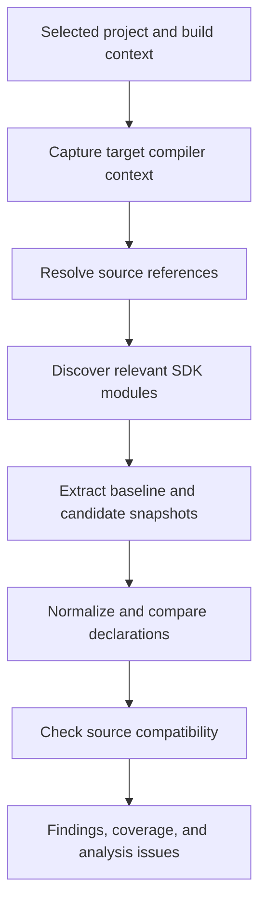

# Analysis

Analysis answers two separate questions: how the selected SDK surface changed, and whether those changes or compiler differences affect the selected project context. A finding is credible only when SwiftDelta can connect SDK or compiler evidence to the project and account for required coverage.

<p align="center">
  
</p>
<p align="center"><sub>The selected finding keeps source impact and SDK evidence beside the coverage summary.</sub></p>

## Choose an analysis mode

The Analysis screen offers:

- **SDK analysis**: extract and compare relevant SDK modules, resolve project source references, and match SDK differences to those references.
- **SDK and build comparison**: run SDK analysis, build the selected context with both Xcodes, and compare normalized diagnostics and build settings.

Both modes use the same project, container, scheme, configuration, platform, SDK, destination, architecture, deployment target, and compilation conditions established during setup. [Build comparison](BuildComparison.md) covers the additional build path.

## Evidence flow



SwiftDelta derives Apple API facts from the selected local SDKs. It does not consult a prewritten migration catalog.

## Target-aware source context

For Xcode containers, SwiftDelta uses the selected container, scheme, configuration, SDK, and destination to obtain target membership and build settings. Analysis captures real isolated-build Swift driver invocations when the toolchain emits reusable commands. These preserve module boundaries, target dependencies, language mode, active conditions, search paths, bridging headers, strict-concurrency settings, architecture, platform variant, and deployment target.

For a locally resolvable Swift Package, SwiftDelta uses package description and build evidence under the selected toolchain. Package targets, dependencies, platform constraints, plugins, macros, and generated-source requirements remain visible in the resulting context.

Build-setting reconstruction is not promoted to authoritative compiler evidence. When exact context cannot be captured and the missing context is required, coverage is incomplete.

Files discovered under the root but outside the selected targets are recorded as excluded. Generated files are recorded separately. Same-named targets in different containers remain distinct because context identity includes the container and build context.

## Reference resolution

Swift source resolution prefers compiler-derived declaration identities. SwiftDelta handles direct declarations, members, overloads, generic uses, extension members, initializers, operators, subscripts, imported Objective-C declarations, conditional compilation, and project-module context to the extent exposed by the selected compiler artifacts.

The resolver tracks normalized unique source paths rather than counting compiler documents. For every requested source file it records one disposition:

- analyzed with relevant SDK references;
- analyzed with no relevant SDK references;
- failed;
- missing compiler output;
- excluded from the selected target;
- generated;
- unreadable;
- unsupported.

Duplicate, malformed, unknown, path-mismatched, and missing compiler documents are failures. A nonzero compiler exit cannot yield complete coverage even if partial structured output decoded. Safe smaller-batch retries can recover missing files; usable partial identities are retained as incomplete evidence rather than discarded or presented as authoritative.

Unresolved references are categorized. SwiftDelta does not replace a missing identity with an unqualified textual guess.

## SDK module discovery

Module selection combines available evidence from:

- active Swift imports;
- compiler or index references;
- Clang-imported modules and module maps;
- target and build dependencies;
- exact compiler arguments;
- explicit project configuration.

Each selected module records why it was needed and the source paths or target that supplied the reason. Incomplete source resolution cannot silently narrow module extraction; a required discovery gap becomes an analysis issue.

## SDK extraction

SwiftDelta inspects each selected Xcode independently and resolves the requested SDK, version, path, target triple, Swift compiler identity, and relevant modules. `swift-symbolgraph-extract` is the primary structured source for Swift SDK symbols.

If symbol-graph extraction fails or times out, SwiftDelta attempts a Swift-interface fallback only when that evidence is valid. The module records whether it came from a symbol graph, a Swift interface, or the persistent cache. Interface declarations lack compiler USRs, so identity confidence and repair eligibility are lower.

If both extraction paths fail, the module is marked failed. SwiftDelta never interprets a failed or partial candidate snapshot as mass API removal.

The Analysis timeout reaches baseline and candidate extraction. Timeout details identify the operation, SDK, module, Xcode identity, elapsed time, and effective limit.

## Snapshot cache

Successful module snapshots may be stored at:

```text
~/Library/Caches/org.swiftdelta/SDKSnapshots/v1
```

The cache key includes the canonical developer directory, Xcode build, SDK identifier, version and path, target triple, Swift compiler identity, module, extraction options, access level, extraction mode, snapshot format, and normalization version.

Writes are atomic and guarded by per-entry file locks. Entries include a SHA-256 digest and are structurally validated before use. Failed or partial extraction is not cached as successful evidence; corrupt entries are removed. Cache data contains normalized SDK metadata, not project source.

Policies are:

- `use`: read a matching entry and write successful misses;
- `refresh`: extract again and replace successful entries;
- `disabled`: do not read or write persistent entries.

Settings can inspect size and count, prune by configured age or size, or clear SwiftDelta-owned entries. Cache maintenance does not touch unrelated caches.

## Normalization and comparison

Before comparison, SwiftDelta normalizes declaration formatting, platform identities, duplicate availability records, duplicate symbols, aliases, generic constraints, parameter labels and types, return types, async and throwing behavior, actor and concurrency annotations, ownership metadata, parent identity, and overload relationships.

This prevents formatting-only changes, equivalent overload evolution, repeated availability records, and alias-only presentation changes from becoming migration findings. Added defaulted parameters and other source-compatible overload evolution are evaluated as source compatibility rather than exact-identity loss.

SDK differences retain the module, platform, old and new declarations, symbol identities, selected Xcode and SDK identities, extraction quality, change kind, and any SDK-supplied rename or migration metadata.

## Source-compatibility decisions

An old symbol identity disappearing is not enough to report a confirmed removal. SwiftDelta uses this evidence order:

1. candidate compiler resolution for the active source expression;
2. candidate diagnostics and structured Fix-its;
3. stable candidate identities and complete overload sets;
4. Swift-interface or Clang-imported declaration evidence;
5. conservative structural comparison.

Compatibility checks account for argument-label binding, defaulted parameters, trailing closures, generic constraints, optionality, variadics, async and throwing behavior, isolation, Sendable-related annotations, preconcurrency, member kind, aliases, availability, and overload ambiguity where that information is present.

If an existing expression still resolves, a vanished exact identity is suppressed or downgraded. If every candidate is incompatible, removal can remain a finding. If compatibility cannot be established either way, SwiftDelta reports uncertainty according to the configured threshold rather than promoting it to a high-confidence failure.

## Direction and severity

Compiler severity remains separate from confidence. Candidate warnings remain warnings; errors remain errors; notes and remarks are informational. A new diagnostic is not promoted merely because it appears only in the candidate build.

SDK restrictions are directional. Added isolation or requirements may create risk; removed isolation or added `nonisolated` generally relaxes source constraints. Attribute ordering and equivalent formatting do not produce findings. Multiple facets of one root signature change are consolidated rather than counted independently.

Availability and build-setting differences are filtered to the selected platform and explicit target context. An iOS comparison does not report watchOS- or tvOS-only changes unless that context was selected.

## Coverage and completeness

Baseline and candidate coverage are recorded separately for each SDK and target. Entries include:

- Xcode and Swift identity;
- platform, scheme, target, configuration, destination, architecture, and deployment target;
- requested and successfully analyzed files;
- files with no relevant SDK references;
- failed, missing, excluded, generated, unreadable, and unsupported files;
- declaration, stable-identity, and unresolved reference counts;
- unresolved reasons;
- compiler exit status;
- completeness.

SDK module status separately records successful, partial, fallback, cached, and failed extraction. Candidate coverage loss cannot silently suppress or confirm a source-compatibility conclusion.

Analysis states are:

- `completeAndClean`;
- `completeWithFindings`;
- `incomplete`;
- `blocked`.

The TUI renders these as `PASS`, `FAIL`, `INCOMPLETE`, and `BLOCKED`. Required incomplete coverage is not a pass, even with no findings. See [Reports](Reports.md) for the result and schema contract.

## Language boundaries

Swift receives the deepest source path: SwiftSyntax parsing, compiler context, and stable reference resolution. Swift-facing Objective-C APIs can participate through Clang Importer evidence.

Where exact compile commands and structured Clang artifacts are available, SwiftDelta can report native Objective-C, Objective-C++, C, and C++ diagnostics. This is not complete native SDK migration analysis. Native automatic repair remains limited to exact compiler-provided Clang Fix-its.

## Limits of static evidence

SwiftDelta cannot detect unchanged-signature behavior changes, UI or lifecycle changes, permissions, race conditions, resource changes, runtime reflection behavior, device-only failures, or business-logic regressions. Complete Analysis means the required implemented analysis finished; it does not mean every possible upgrade risk has been proven absent.
