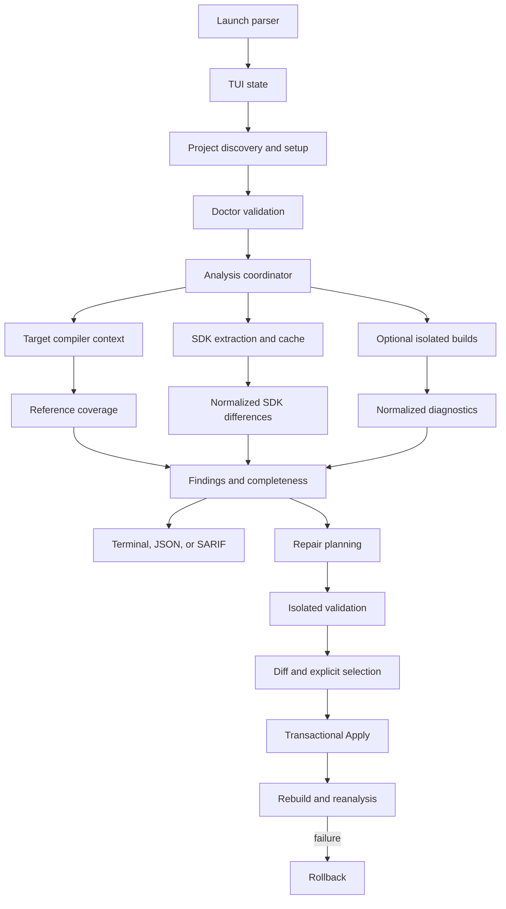

# Architecture

SwiftDelta separates terminal presentation from compatibility analysis. The executable owns launch parsing, terminal lifecycle, TUI state, settings, and adapters. `SwiftDeltaCore` owns project discovery, tool execution, SDK evidence, source analysis, diagnostics, reports, repair planning, validation, application, and rollback.

The TUI calls core services directly; it does not launch another SwiftDelta process.

## Package structure

| Target | Responsibility |
| --- | --- |
| `SwiftDelta` | Launch-only argument parsing and the full-screen terminal application. |
| `SwiftDeltaCore` | Reusable discovery, analysis, build, reporting, cache, and repair services. |
| `CDiagnosticReader` | Native bridge used for structured compiler diagnostics. |
| `SwiftDeltaCLITests` | Launch, TUI state, rendering, settings, input, and PTY contracts. |
| `SwiftDeltaCoreTests` | Core unit, schema, integration, repair, and toolchain contracts. |

Within `SwiftDeltaCore`, directories follow the data flow:

- `Discovery` identifies project roots, containers, schemes, and source membership.
- `Configuration` loads and validates read-only project configuration.
- `Build` inspects Xcodes, captures build context, performs isolated builds, and classifies failures.
- `Analysis/Source` resolves target-aware compiler references and file coverage.
- `SDK` extracts, caches, normalizes, and compares SDK modules.
- `Diagnostics` reads and merges structured and fallback diagnostics.
- `Application` coordinates Analysis modes and completeness.
- `Reporting` renders terminal, JSON, and SARIF reports.
- `Repair` owns evidence, planning, model drafts, validation, transactional application, verification, and repair-plan output.
- `Infrastructure` contains filesystem and process boundaries.
- `Domain` contains stable report and evidence models.

The executable's `TUI` directory separates terminal lifecycle, capability detection, input decoding, rendering, components, application state, asynchronous operations, and persistence.

## Operation flow

## Setup identity and invalidation

Analysis evidence is bound to the container, target, scheme, configuration, SDK, destination, architecture, deployment target, platform variant, compilation conditions, and selected Xcode identities. Context keys include the container so same-named targets in different projects do not collide.

The TUI records whether setup values were discovered, loaded, or selected. A material change invalidates only Doctor, Analysis, Repair, and cached in-memory evidence that depends on that context. Persistent SDK snapshot identity separately prevents reuse across mismatched toolchains or normalization formats.

## Process boundary

All subprocesses are executed through a process abstraction with explicit arguments rather than shell interpolation. Long operations receive timeouts, cancellation, isolated environment values, bounded output handling, and progress events. Baseline and candidate toolchains receive independent `DEVELOPER_DIR` and artifact roots.

Cancellation terminates active children, cleans temporary state, and returns the TUI to a stable screen. Supported process signals pass through the same cleanup path before terminal restoration.

This boundary controls SwiftDelta's invocation and artifacts. It does not sandbox project-provided executables.

## Evidence and confidence

The core keeps three concepts separate:

- **severity**: impact emitted by the compiler or assigned to an SDK finding;
- **confidence**: strength of the source-to-SDK match;
- **completeness**: whether required analysis finished.

Stable compiler identities and candidate diagnostics outrank structural declaration comparison. Partial evidence remains visible with its limitations. Operational failures never masquerade as source findings.

## Reporting contracts

`AnalysisReport` is the source for terminal, JSON, and SARIF output. Renderers normalize project paths without mutating the model. Native JSON and repair-plan JSON use independent checked-in schemas and independent format versions.

Finding identifiers and ordering are stable for unchanged evidence. A run retains its own generation time without using random values as finding identity.

## Repair boundary

Repair consumes the current Analysis result instead of starting a narrower analysis. Deterministic evidence is considered before Apple Foundation Models. The on-device provider receives bounded context for one source occurrence and has no file, process, network, or tool access.

Model output becomes a Draft or disposition; it does not own project paths, byte offsets, source fingerprints, symbol identities, or toolchain selection. SwiftDelta resolves anchors locally and validates source structure and candidate SDK symbols.

Preview and validation use isolated copies. Apply uses a transaction that retains original bytes, checks all selected edits before writing, and restores all files if final verification fails. See [Repair](Repair.md).

## Terminal boundary

External text is sanitized before rendering. The terminal layer owns raw mode, alternate-screen entry, cursor state, mouse reporting, resize events, style reset, and differential rendering. Cleanup is idempotent across normal exit, cancellation, supported signals, startup failure, and thrown errors.

Terminal capabilities change presentation only. They do not alter Analysis or Repair decisions.

## Extension rules

Changes to SDK compatibility should add a general evidence reader, normalizer, or semantic comparator. They must not add API-specific Apple migration rules or infer edits from prose alone.

New report fields require a deliberate schema and format-version decision. New repair evidence must preserve exact source identity, protected-path checks, isolated verification, and rollback.
