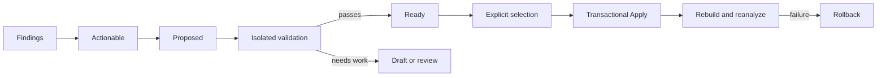

# Repair

Repair turns current Analysis evidence into auditable source proposals. It does not infer edits from diagnostic prose alone, and it does not treat every SDK metadata change as a required migration.

The original project remains unchanged during planning, Diff review, Draft editing, and isolated validation. Apply requires an explicit selection and confirmation.

> **Only analyze projects you trust. Repair validation and final verification may execute build phases, package plugins, macros, generators, and other project-provided build tools.**

<p align="center">
  
</p>
<p align="center"><sub>Focus, selected-for-Apply state, the diff, and validation outcome remain distinct.</sub></p>

## Repair lifecycle



Entering Repair with a current Analysis result starts bounded planning and validation automatically. The normal flow is:

1. account for every Analysis finding;
2. collect deterministic repair evidence;
3. ask the on-device Apple Foundation Models provider only for eligible findings that deterministic evidence could not repair;
4. validate paths, fingerprints, anchors, ranges, syntax, symbols, platform, evidence, and conflicts;
5. validate viable proposals in isolated project copies;
6. promote successful proposals to **Ready**;
7. let the user review the complete Diff and select Ready items;
8. apply selected edits through a transaction;
9. rebuild and reanalyze under the candidate Xcode;
10. roll back every modified file if final verification fails.

`Validate Again` and the `V` accelerator are for edited, failed, stale, or previously validated proposals. Initial viable proposals do not require manual validation one by one.

## Evidence order

Repair considers evidence in this order:

1. structured Swift compiler Fix-its;
2. structured Clang Fix-its;
3. exact SDK `renamed` metadata with stable old and replacement identities;
4. exact mechanically compatible signature or parameter-label changes;
5. candidate compiler diagnostics and deterministic candidates;
6. on-device Apple Foundation Models proposals when deterministic evidence is insufficient.

The model never replaces a stronger compiler or SDK edit.

An SDK rename becomes deterministic only when the source occurrence resolves to the old symbol, the replacement exists in the candidate SDK, the identifier range is exact, declaration shapes remain mechanically compatible at the use site, and no overload ambiguity exists. A rename that requires new arguments, control flow, async behavior, ownership, or error handling remains a Draft or manual review item.

Informational deprecation, availability, documentation, or concurrency metadata does not independently justify a source edit.

## Dispositions and funnel

Every Analysis finding receives one visible disposition. The funnel shows:

```text
Findings → Actionable → Proposed → Validated → Ready → Selected
```

The candidate lifecycle uses:

- **Planning**: evidence is being collected;
- **Validating**: the proposal is being normalized, parsed, and built in isolation;
- **Ready**: required validation passed and the item can be selected;
- **Needs Review**: a concrete proposal exists but unresolved semantic or evidence risk remains;
- **No Safe Fix**: no exact source change is justified;
- **Failed**: generation, normalization, syntax, evidence, or verification failed;
- **Stale**: the source no longer matches the validated plan.

Excluded findings retain a reason such as no source change required, no candidate replacement, unresolved reference, wrong platform, ambiguous evidence, no usable model edit, protected path, or failed validation. Planning failures and real edit conflicts are separate; multiline or structural edits are not conflicts by themselves.

## Repair list and inspector

The default filter leads with actionable candidates. Additional filters show Ready, validating, review, failed, no-fix, and all dispositions. Rows identify status, file and line, symbol, summary, evidence source, confidence, and validation state. Repeated findings can be grouped without hiding individual occurrences.

Focus and selection are separate. Enter or double-click opens the selected candidate. Space or **Select Repair** toggles only a Ready item. Apply remains unavailable when no valid item is selected.

Wide terminals display a candidate list beside an inspector. Narrower terminals open the same inspector as a large scrollable view. The inspector separates:

- original and proposed source;
- unified or side-by-side Diff;
- compiler and SDK evidence;
- explanation, assumptions, and risks;
- baseline and candidate toolchain identities;
- syntax, symbol, conflict, and verification results;
- the exact next available action.

Added Diff lines and fragments use restrained green; removed content uses restrained red; unchanged context uses the terminal's adaptive foreground. Monochrome and `NO_COLOR` use gutters and text markers instead of relying on color. Long lines and multiple edit blocks remain horizontally and vertically scrollable.

## Draft Repairs

A concrete Apple Foundation Models response becomes a stable Draft when its edit intent is usable but not Ready. Drafts retain the finding, source language and file, edit operations, original anchors, proposed source, explanation, evidence, assumptions, risks, initial validation issues, model generation, and reasoning level.

Recoverable conditions include whitespace-different or incomplete anchors, syntax needing correction, evidence-citation mismatch, multiline source, insertions, deletions, coordinated edits, expression-shape changes, and review-only confidence. Hard path escapes, protected or generated files, dependencies, SDK or Xcode content, binaries, and responses with no source-edit intent remain rejected.

**Edit Draft** opens a bounded multiline editor with the original source, proposed source, file and range, explanation, and current problems. Saving a Draft does not modify the project. The edited Draft must pass the same isolated validation before it can become Ready.

Anchor normalization attempts exact matching, normalized whitespace, unique token sequences, SwiftSyntax nodes, and an enclosing call or declaration. Multiple matches remain ambiguous; SwiftDelta does not guess.

## Apple Foundation Models

SwiftDelta uses only the host Mac's `SystemLanguageModel.default`. There is no Private Cloud Compute, cloud, remote, or network fallback. When the on-device model is unsupported, disabled by the system, not ready, unsupported for the locale, or missing guided-generation capability, model controls are hidden and deterministic Repair continues.

The provider uses `LanguageModelSession`, typed `@Generable` output, `@Guide` constraints, guided `respond(generating:)`, and an empty tool list. On macOS 26.4 and later, supported token-count and context-size APIs bound the request. macOS 26.0–26.3, 26.4, and 27 use separate focused instruction sets. On macOS 27, configurable reasoning is offered only when `LanguageModelCapabilities` reports it; the default is `deep`, and no silent downgrade occurs.

The model receives one bounded repair context:

- normalized compiler diagnostic and Fix-its when available;
- exact source fragment and enclosing declaration;
- language and permitted editing region;
- stable source fingerprint and source location;
- resolved old and candidate SDK symbols and declarations;
- availability, signature, rename, and concurrency differences;
- selected target, SDK, destination, deployment context, and toolchain identities;
- deterministic candidates already considered;
- explicit edit restrictions.

It does not receive the repository, unrelated files, shell access, file-writing access, build tools, network tools, Git, signing, or publication capabilities.

Program code owns file paths, fingerprints, byte ranges, USRs, diagnostic identities, toolchain identity, and permitted boundaries. The model returns a disposition, anchored replace/insert-before/insert-after/delete operations, revised source, explanation, assumptions, and risks. SwiftDelta resolves UTF-8 ranges locally.

Eligible findings need an exact project source location, an unambiguous source token or syntax node, stable SDK identity, meaningful old and new declarations, and enough surrounding source. A uniquely matching compiler diagnostic is preferred but not mandatory. Unresolved textual matches, generated files, dependencies, unused SDK differences, duplicates, and findings without an exact anchor are not sent.

Equivalent findings are deduplicated and prioritized. Requests are bounded by the configured candidate limit with a hard maximum of `100`, the model timeout, cancellation, context capacity, and at most two recoverable retries after the initial request. The TUI reports considered, processed, Draft, converted, rejected, skipped, deduplicated, deferred, timeout, and cancellation counts without calling a safety rejection “model unavailable.”

Every model-originated plan entry includes:

- `generatedBy: "Apple Foundation Models"`;
- `provider: "on-device"`;
- `execution: "On-device"`;
- `hostModelGeneration`;
- `reasoningLevel`;
- `modelGenerated: true`;
- `requiresReview: true`.

Deterministic repairs do not receive model provenance.

## Structural validation

Repair supports exact single-line and multiline replacement, insertion before or after an anchor, deletion, and bounded coordinated edits. Structural shape is not an automatic rejection.

For each proposal SwiftDelta:

1. canonicalizes the project root and source path;
2. rejects protected, generated, dependency, metadata, SDK, Xcode, cache, build-product, binary, and unsupported files;
3. checks the source SHA-256 fingerprint;
4. resolves anchors uniquely inside the allowed region and computes UTF-8 ranges locally;
5. normalizes and sorts edits;
6. detects invalid ranges, duplicates, same-edit findings, overlaps, and contradictions;
7. applies edits to an isolated copy;
8. parses Swift with SwiftSyntax or uses the available native-language validation path;
9. rejects introduced imports, symbols, or signatures that do not resolve under the candidate SDK and compiler;
10. builds and reanalyzes the selected candidate context.

Complex changes such as availability wrappers, async or actor adjustments, Sendable-related edits, declaration rewrites, call-chain changes, and control-flow changes can be represented and validated. Compilation alone does not make them semantically safe. They remain **Needs Semantic Review** unless stronger evidence establishes the behavior.

## Verification

Before and after snapshots use the same target-aware planning and build context. Verification requires:

- the selected source files were successfully analyzed before and after;
- the target, SDK, destination, and build context identity match;
- the targeted finding occurrence or structured evidence disappears;
- it did not disappear because a file, target, module, diagnostic reader, or reference context was lost;
- candidate source parses and the build succeeds;
- no new compiler error appears;
- no diagnostic severity increases;
- unresolved and stable-identity coverage does not regress unexpectedly.

The TUI distinguishes **Build Verified**, **Test Verified**, and **Needs Semantic Review**. SwiftDelta performs build verification; it does not run the application's test suite, so it does not claim Test Verified.

## Apply and rollback

Apply accepts only selected repairs that exactly match the current plan and are explicitly applicable. Before writing it rechecks project-root identity, conflicts, path policy, fingerprints, ranges, and original text. All files are validated before the first replacement.

The transaction stages complete replacement files outside the source tree and preserves UTF-8, line endings, final-newline state, permissions, comments, and untouched whitespace. It does not reformat a file to apply a small edit.

After writing, SwiftDelta repeats candidate build and target-aware evidence capture. Any write, build, analysis, diagnostic, or coverage failure restores every selected file from retained original bytes and verifies restoration. The original verification error is preserved if rollback also fails.

There is no force-apply or keep-unverified-edits option. A successful edit is idempotent, is not offered again, and makes an older plan stale.

## Protected boundary and language support

Repair accepts supported source extensions only inside the canonical selected root: `.swift`, `.m`, `.mm`, `.c`, `.cc`, `.cpp`, `.cxx`, `.h`, `.hh`, `.hpp`, and `.hxx`. An extension permits inspection, not automatic application.

Repair rejects path escapes, symlinks resolving outside the root, Apple SDK and Xcode content, dependencies and caches, DerivedData and build products, generated source when identified, `Package.swift`, `Package.resolved`, `.pbxproj`, workspaces, binaries, and non-UTF-8 files that cannot be edited without conversion.

Swift automatic repair can use structured Swift Fix-its and exact SDK-derived evidence. Native Objective-C, Objective-C++, C, C++, and header automatic repair remains limited to exact structured Clang Fix-its associated with precise native ranges. Swift-facing imported names are never translated back into native source without a native compiler edit.

## Repair-plan format

JSON repair plans use `repairPlanFormatVersion` `3.0` and [RepairPlan.schema.json](Schemas/RepairPlan.schema.json). Entries include a stable repair identifier, related finding, evidence source, language, project-relative file, UTF-8 range, original and replacement text, SHA-256 fingerprint, confidence, safety, explanation, verification requirement, toolchain and symbol evidence, compiler context, and optional model provenance.

Plans also contain explicit conflicts and planning failures. Loading a plan does not bypass validation or verification. A stale plan is refused.
