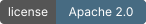
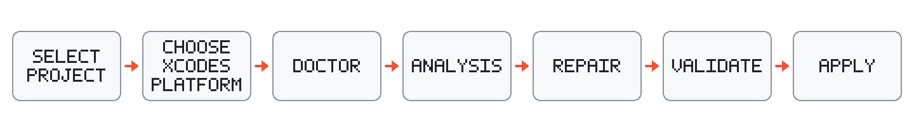
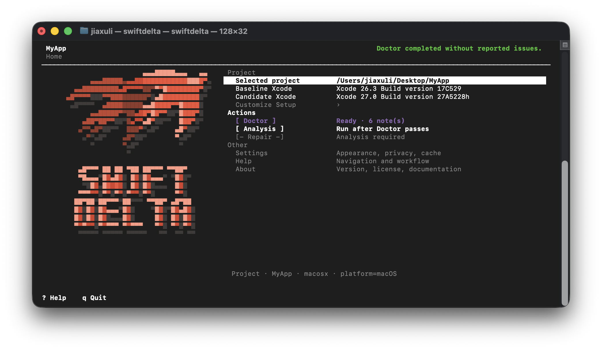
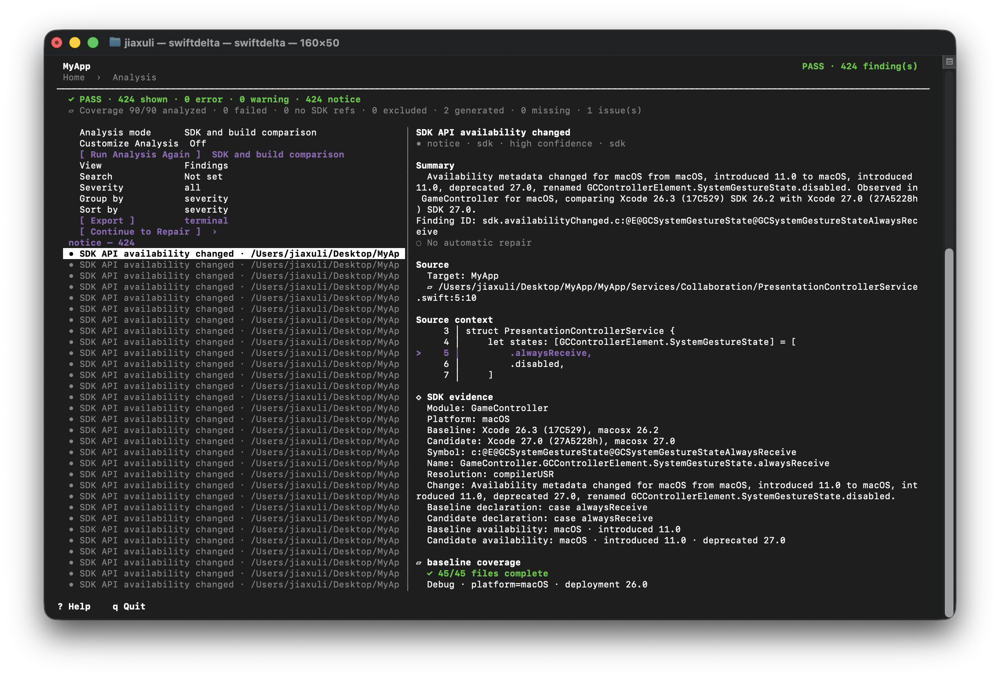
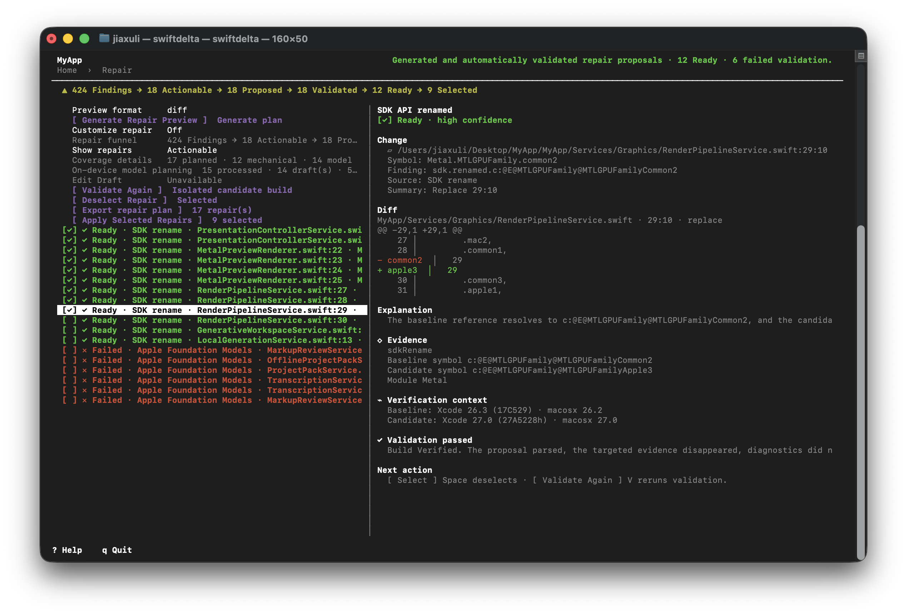

<h1 align="center">
  
</h1>

<p align="center"><strong>Compare an Apple-platform project across two local Xcodes, then review and verify evidence-backed source repairs.</strong></p>

<p align="center">
  
  
  
  
</p>

SwiftDelta is a full-screen terminal application for evaluating an Apple-platform project before an Xcode upgrade. It reads the selected SDKs, resolves project source references in their build contexts, compares compiler diagnostics from isolated builds, and presents the result as findings with explicit coverage.

Compatibility facts come from the two selected Xcode installations: SDK symbol metadata, Swift interfaces, compiler diagnostics, structured Fix-its, and real source resolution. SwiftDelta does not ship a catalog of Apple API migration rules.

> **Only analyze projects you trust. Build comparison and repair verification may execute build phases, package plugins, macros, generators, and other project-provided build tools.**

SwiftDelta does not launch the target application. Doctor can identify known execution risks, but it is not an operating-system sandbox.

## What SwiftDelta does

- Compares SDK declarations from an explicitly selected baseline and candidate Xcode.
- Captures target-aware source context for Xcode projects, workspaces, and locally resolvable Swift Packages.
- Compares baseline and candidate build diagnostics without promoting candidate warnings to errors.
- Reports analyzed, failed, excluded, generated, and unresolved source coverage separately.
- Exports terminal, native JSON, and SARIF reports from the completed Analysis screen.
- Plans source repairs from compiler Fix-its, exact SDK rename metadata, and other structured evidence.
- Validates viable repairs in an isolated copy before allowing selection and Apply.
- Uses the host Mac's on-device Apple Foundation Models system model as an optional repair-planning source when the model is available.

SwiftDelta cannot establish compatibility for runtime behavior, UI changes, permissions, lifecycle behavior, races, data migration, or device-only failures. Continue to run the project's normal test and release process after an upgrade.

## Workflow

<p align="center">
  
</p>

Setup, Doctor, Analysis, and Repair remain separate. Doctor validates the environment. Analysis runs only when selected. Entering Repair with current Analysis evidence starts bounded preview planning and isolated validation, but never selects or applies an edit.

## Requirements

- macOS 13 or later
- Swift 6.4
- an interactive terminal or PTY
- two local Xcode installations for an upgrade comparison
- project dependencies available locally when an offline build requires them

The package pins SwiftSyntax `603.0.2`. Apple Foundation Models repair requires a supported Mac, a supported macOS release, Apple Intelligence enabled by the system, and ready local model assets. Deterministic Analysis and Repair remain available when those conditions are not met.

## Build from source

Clone or unpack the source, then build the release executable with Swift Package Manager:

```sh
swift build -c release
swift build -c release --show-bin-path
```

The second command prints the directory containing `swiftdelta`. Run the executable there or copy it to a directory already on your `PATH`.

SwiftPM may resolve SwiftSyntax from the package URL when it is not cached. For a deliberately offline build, resolve dependencies beforehand and add `--disable-automatic-resolution` to the build command. SwiftDelta itself does not intentionally perform network requests during analysis.

## Quick start

1. Launch the application in a terminal:

   ```sh
   swiftdelta
   ```

2. Select a project root. SwiftDelta discovers Swift Packages, `.xcodeproj` files, `.xcworkspace` files, shared schemes, configurations, and supported platform contexts.
3. Choose the baseline and candidate Xcode explicitly. The same installation or equivalent build cannot fill both roles.
4. Choose a supported platform context. The selection supplies the matching SDK and destination together.
5. Let Doctor validate the setup. Resolve any blocking issue before continuing.
6. Open Analysis, choose **SDK analysis** or **SDK and build comparison**, then select **Run Analysis**.
7. Review the outcome, coverage, findings, and analysis issues. Export a report if needed.
8. Continue to Repair. Review automatically planned candidates and their validation results.
9. Select only **Ready** repairs whose Diffs and risks you accept, then confirm **Apply Selected Repairs**.

The complete walkthrough is in [Getting started](Documentation/GettingStarted.md).

<p align="center">
  
</p>
<p align="center"><sub>Home keeps project setup and the next available operation in one place.</sub></p>

## Launch options

SwiftDelta has no operational subcommands or headless analysis mode. These are the only launch forms:

```text
swiftdelta
swiftdelta --help
swiftdelta -h
swiftdelta --version
swiftdelta -V
swiftdelta --safe-mode
swiftdelta --project <path>
```

`--safe-mode` ignores stored settings and history without deleting them. `--project` validates and preselects a directory, then starts setup discovery inside the TUI. Doctor can run automatically after setup is complete; Analysis and Repair still require their normal TUI actions. Help and version work without a TTY. Normal launch requires a terminal or PTY.

Former commands such as `scan`, `compare`, `doctor`, and `repair` are rejected with directions to launch the interactive application.

## Reading the result

Analysis uses four states:

| State | Meaning |
| --- | --- |
| `PASS` | Required analysis completed and no finding reached the configured failure threshold. |
| `FAIL` | Required analysis completed and at least one finding reached the threshold. |
| `INCOMPLETE` | Some evidence exists, but required source, target, or SDK coverage did not complete. |
| `BLOCKED` | An operational or toolchain failure prevented the required analysis. |

An empty finding list is not a pass when required coverage is incomplete. The Analysis screen reports baseline and candidate source coverage, unresolved reasons, SDK module extraction quality, and operational failures separately from compatibility findings.

Exports preserve the same meaning:

- terminal text for reading and archival;
- native JSON using report format `3.0` and the checked-in schema;
- SARIF `2.1.0` with project-relative locations and incomplete-analysis notifications.

See [Reports and result states](Documentation/Reports.md).

<p align="center">
  
</p>
<p align="center"><sub>Analysis keeps completeness, findings, source context, and SDK evidence separate.</sub></p>

## Repair safety

Repair is preview-first. A finding becomes a selectable repair only after the proposal passes applicable checks for project containment, protected paths, source fingerprint, exact anchors and ranges, syntax, edit conflicts, SDK evidence, and isolated candidate-Xcode verification.

Apply requires explicit confirmation. SwiftDelta then rechecks the plan, writes only selected supported source files through a transaction, rebuilds and reanalyzes, and restores every modified file from retained original bytes if final verification fails. There is no unverified Apply mode.

`Build Verified` means the selected candidate build context accepted the change and the targeted evidence disappeared without a diagnostic or coverage regression. It does not prove runtime or semantic equivalence. Behavior-sensitive changes remain marked for review.

Native Objective-C, Objective-C++, C, and C++ automatic repair is limited to exact compiler-provided Clang Fix-its. See [Repair](Documentation/Repair.md) for the evidence hierarchy and protected-file policy.

<p align="center">
  
</p>
<p align="center"><sub>Repair separates proposal status, selection, the exact diff, and verification evidence.</sub></p>

## Apple Foundation Models

When `SystemLanguageModel.default` is available on the host Mac, SwiftDelta enables the on-device model stage automatically after deterministic strategies are exhausted. The application uses typed guided generation for one focused finding at a time. File identity, permitted ranges, SDK identities, and verification remain owned by SwiftDelta rather than the model.

Model controls are hidden when the system model is unsupported, disabled by the system, not ready, or unavailable for the current locale or capability. There is no Private Cloud Compute, cloud-model, remote-model, or network fallback. Model proposals are labeled as Apple Foundation Models output, remain reviewable as Draft Repairs when recoverable validation work is needed, and cannot bypass candidate-Xcode verification.

## Privacy and trust

Settings are stored under `~/Library/Application Support/SwiftDelta`. Optional project history is disabled by default. SDK snapshots are stored under `~/Library/Caches/org.swiftdelta/SDKSnapshots/v1` and contain normalized SDK metadata, not project source.

SwiftDelta does not intentionally persist source text, model context, complete compiler logs, repair staging files, secrets, or temporary project copies. Reports and repair plans are written only when explicitly exported.

Build comparison and repair verification invoke Xcode, Swift, Clang, SwiftPM, and related tools. A target project's scripts, plugins, macros, generators, or custom rules run with the permissions of the SwiftDelta process and may access the network. Artifact isolation does not create an execution sandbox. Read the [Security policy](SECURITY.md) before analyzing an unfamiliar project.

## Terminal interface

Arrow keys move through rows; Enter opens; Space toggles a value or selects an applicable repair; Escape closes a view or requests cancellation. Tab and Shift-Tab move between visible focus areas. Mouse selection, double-click activation, wheel scrolling, search, filtering, grouping, and sorting are also available.

SwiftDelta retains the terminal's native background and supports True Color, 256-color, basic color, monochrome, `NO_COLOR`, high contrast, reduced motion, Unicode, and ASCII fallbacks. Wide terminals use detail panes; narrower terminals use drill-down views. The minimum supported viewport is 64 columns by 18 rows.

See [Terminal interface](Documentation/TerminalInterface.md) for the complete control reference and terminal-recovery commands.

## Documentation

Start with the [documentation index](Documentation/README.md).

| Need | Document |
| --- | --- |
| First successful comparison | [Getting started](Documentation/GettingStarted.md) |
| TUI controls and setup | [Terminal interface](Documentation/TerminalInterface.md) |
| SDK and source analysis | [Analysis](Documentation/Analysis.md) |
| Real build comparison | [Build comparison](Documentation/BuildComparison.md) |
| Repair and rollback | [Repair](Documentation/Repair.md) |
| Reports and schemas | [Reports](Documentation/Reports.md) |
| Project configuration and settings | [Configuration](Documentation/Configuration.md) |
| Internal design | [Architecture](Documentation/Architecture.md) |
| Troubleshooting | [Troubleshooting](Documentation/Troubleshooting.md) |
| Common questions | [FAQ](Documentation/FAQ.md) |
| Contributor verification | [Testing](Documentation/Testing.md) |

## Credits

SwiftDelta uses [SwiftSyntax](https://github.com/swiftlang/swift-syntax) and SwiftParser for Swift source parsing and syntax validation. It is built with Swift and Apple developer tooling.

## Project information

- [Contributing](CONTRIBUTING.md)
- [Security](SECURITY.md)
- [Code of Conduct](CODE_OF_CONDUCT.md)
- [Changelog](CHANGELOG.md)
- [Apache License 2.0](LICENSE)
- [Jiaxu Li](https://jiaxuli.com), project owner

SwiftDelta is open source under the Apache License, Version 2.0. Report security vulnerabilities privately as described in the [security policy](SECURITY.md); that address is not a general support channel.
